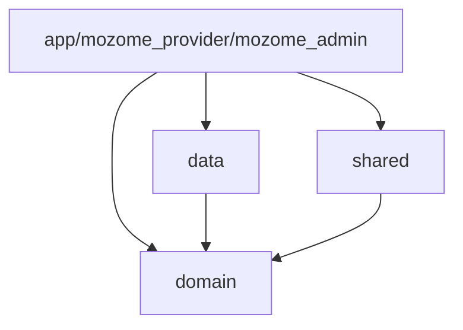
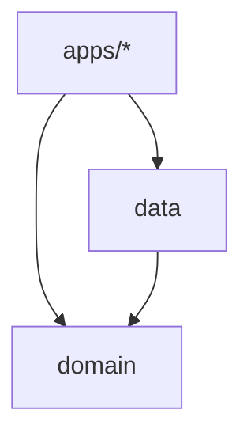

# Mozome Clean Architecture

A Flutter application built with clean architecture principles and Firebase integration.


## Features

1. Architecture: Clean Architecture
1. State management: [flutter_bloc](https://pub.dev/packages/flutter_bloc)
1. Navigation: [auto_route](https://pub.dev/packages/auto_route)
1. DI: [get_it](https://pub.dev/packages/get_it), [injectable](https://pub.dev/packages/injectable)
1. REST API: [dio](https://pub.dev/packages/dio)
1. GraphQL: [artemis](https://pub.dev/packages/artemis), [graphql_flutter](https://pub.dev/packages/graphql_flutter)
1. Database: [objectbox](https://pub.dev/packages/objectbox)
1. Shared Preferences: [encrypted_shared_preferences](https://pub.dev/packages/encrypted_shared_preferences)
1. Data class: [freezed](https://pub.dev/packages/freezed)
1. Lint: [dart_code_metrics](https://pub.dev/packages/dart_code_metrics), [flutter_lints](https://pub.dev/packages/flutter_lints)
1. CI/CD: Github Actions, Bitbucket Pipelines
1. Unit Test: [mocktail](https://pub.dev/packages/mocktail), [bloc_test](https://pub.dev/packages/bloc_test)
1. Paging: [infinite_scroll_pagination](https://pub.dev/packages/infinite_scroll_pagination)
1. Utils: [rxdart](https://pub.dev/packages/rxdart), [dartx](https://pub.dev/packages/dartx), [async](https://pub.dev/packages/async)
1. Assets generator: [flutter_gen_runner](https://pub.dev/packages/flutter_gen_runner), [flutter_launcher_icons](https://pub.dev/packages/flutter_launcher_icons), [flutter_native_splash](https://pub.dev/packages/flutter_native_splash)

## Architecture

This project implements Clean Architecture principles with a strict separation of concerns and unidirectional data flow, organized as a monorepo using Melos.


### Package Organization

The project is organized as a monorepo with multiple packages:

```
mozome-flutter-app/                # Root monorepo
├── domain/                        # Pure Dart - Core Business Logic
│   └── lib/
│       ├── core/                 # Core utilities and base classes
│       │   ├── error/           # Failure handling
│       │   └── usecase/         # Base usecase definitions
│       ├── entities/            # Business objects
│       ├── repositories/        # Abstract contracts
│       └── usecases/           # Business logic units
│
├── data/                         # Pure Dart - Data Layer
│   └── lib/
│       ├── core/               # Data layer utilities
│       ├── data/              # Data implementation
│       │   ├── models/       # Data transfer objects
│       │   ├── repositories/ # Repository implementations
│       │   └── datasources/  # Data providers
│       ├── di/              # Data layer DI
│       └── graphql/        # GraphQL specific code
│
├── app/                         # Main Customer Flutter App
│   └── lib/
│       ├── core/              # App-specific utilities
│       ├── di/               # App dependency injection
│       └── presentation/     # UI Layer
│           ├── pages/       # Screens
│           ├── widgets/     # Reusable widgets
│           └── bloc/        # Business Logic Components
│
├── mozome_provider/            # Provider Flutter App Package
│   └── lib/
│       ├── core/             # App-specific utilities
│       ├── di/              # App dependency injection
│       └── presentation/    # UI Layer
│           ├── pages/      # Screens
│           ├── widgets/    # Reusable widgets
│           └── bloc/       # Business Logic Components
│
├── mozome_admin/              # Admin Flutter App Package
│   └── lib/
│       ├── core/            # App-specific utilities
│       ├── di/             # App dependency injection
│       └── presentation/   # UI Layer
│           ├── pages/     # Screens
│           ├── widgets/   # Reusable widgets
│           └── bloc/      # Business Logic Components
│
├── initializer/              # Project initialization and config
│   └── lib/
│       └── env/            # Environment configuration
│
├── tools/                   # Development and build tools
│   ├── scripts/           # Build and automation scripts
│   └── generators/        # Code generators
│
├── shared/                 # Shared Flutter code
│   └── lib/
│       ├── constants/     # Shared constants
│       ├── theme/        # Common theme definitions
│       ├── utils/       # Shared utilities
│       └── widgets/    # Common widgets
│
└── resources/            # Static resources
    ├── assets/         # Images, fonts, etc.
    ├── l10n/          # Localization files
    └── config/        # Configuration files
```

Key Points:
- **Core Packages**:
  - `domain`: Pure Dart business logic
  - `data`: Data layer implementation
  - `shared`: Common Flutter code

- **Applications**:
  - `app`: Main customer mobile app
  - `mozome_provider`: Service provider app package
  - `mozome_admin`: Admin dashboard app package

- **Support Packages**:
  - `initializer`: Project setup and configuration
  - `tools`: Development utilities and scripts
  - `resources`: Static assets and configurations

Dependency Flow:


### Core Architectural Principles

#### 1. Domain Layer (`packages/domain`)
- **Pure Dart Package**
  - No Flutter dependencies
  - No external package dependencies
  - Framework agnostic

- **Key Components**:
  - **Entities**: Pure business objects
    ```dart
    // domain/lib/entities/user.dart
    class User extends Equatable {
      final String id;
      final String email;
      // ... core business properties only
    }
    ```
  - **Repository Interfaces**: Abstract contracts
    ```dart
    // domain/lib/repositories/user_repository.dart
    abstract class IUserRepository {
      Future<Either<Failure, User>> getUser(String id);
      // ... business operations only
    }
    ```
  - **Use Cases**: Single responsibility actions
    ```dart
    // domain/lib/usecases/get_user.dart
    class GetUser extends UseCase<User, String> {
      final IUserRepository _repository;
      Future<Either<Failure, User>> call(String id) =>
          _repository.getUser(id);
    }
    ```

#### 2. Data Layer (`packages/data`)
- **Implementation Package**
  - Implements domain contracts
  - Handles external data sources
  - Manages data persistence

- **Key Components**:
  - **Models**: Data transfer objects
    ```dart
    // data/lib/models/user_model.dart
    class UserModel {
      factory UserModel.fromJson(Map<String, dynamic> json) => ...
      factory UserModel.fromEntity(User entity) => ...
      User toEntity() => ...
    }
    ```
  - **Repository Implementations**:
    ```dart
    // data/lib/repositories/user_repository_impl.dart
    @Injectable(as: IUserRepository)
    class UserRepositoryImpl implements IUserRepository {
      final GraphQLClient _client;
      final UserMapper _mapper;
      // ... implementation with external dependencies
    }
    ```
  - **Data Sources**:
    ```dart
    // data/lib/datasources/user_remote_datasource.dart
    class UserRemoteDataSource {
      final GraphQLClient _client;
      Future<UserModel> getUser(String id) =>
          _client.query(...);
    }
    ```

#### 3. Application Layer (`apps/*`)
- **Flutter Applications**
  - Platform-specific implementation
  - UI/UX implementation
  - State management

- **Key Components**:
  - **BLoC Pattern**:
    ```dart
    // apps/customer/lib/presentation/bloc/user_bloc.dart
    class UserBloc extends Bloc<UserEvent, UserState> {
      final GetUser _getUser;
      // ... UI state management
    }
    ```
  - **Pages & Widgets**:
    ```dart
    // apps/customer/lib/presentation/pages/user_profile.dart
    class UserProfilePage extends StatelessWidget {
      @override
      Widget build(BuildContext context) =>
          BlocProvider(
            create: (context) => getIt<UserBloc>(),
            child: UserProfileView(),
          );
    }
    ```

### Package Dependencies



#### Domain Package (`packages/domain/pubspec.yaml`)
```yaml
dependencies:
  dartz: ^0.10.1
  equatable: ^2.0.5
  meta: ^1.9.1
```

#### Data Package (`packages/data/pubspec.yaml`)
```yaml
dependencies:
  domain:
    path: ../domain
  graphql: ^5.2.0-beta.7
  injectable: ^2.3.2
```

#### Apps (`apps/*/pubspec.yaml`)
```yaml
dependencies:
  domain:
    path: ../../packages/domain
  data:
    path: ../../packages/data
  flutter_bloc: ^8.1.3
  auto_route: ^7.8.4
```

### Data Flow

1. **User Interaction Flow**:
```
UI Action → BLoC Event → UseCase → Repository Interface → Implementation → DataSource
```

2. **Data Return Flow**:
```
DataSource → Model → Entity → UseCase → BLoC State → UI Update
```

### Testing Strategy

#### 1. Domain Testing (`packages/domain/test/`)
```dart
void main() {
  test('GetUser use case should return User entity', () {
    final useCase = GetUser(mockRepository);
    final result = await useCase('user_id');
    expect(result.isRight(), true);
  });
}
```

#### 2. Data Testing (`packages/data/test/`)
```dart
void main() {
  test('UserRepositoryImpl should map API response to Entity', () {
    final repository = UserRepositoryImpl(mockDataSource);
    final result = await repository.getUser('user_id');
    expect(result.isRight(), true);
  });
}
```

#### 3. App Testing (`apps/*/test/`)
```dart
void main() {
  blocTest<UserBloc, UserState>(
    'emits [loading, loaded] when GetUser succeeds',
    build: () => UserBloc(mockGetUser),
    act: (bloc) => bloc.add(GetUserEvent('user_id')),
    expect: () => [UserState.loading(), UserState.loaded(user)],
  );
}
```

### Error Handling

1. **Domain Layer**: Type-safe failures
```dart
abstract class Failure extends Equatable {
  final String message;
  const Failure(this.message);
}
```

2. **Data Layer**: Exception mapping
```dart
Future<Either<Failure, User>> getUser(String id) async {
  try {
    final model = await _dataSource.getUser(id);
    return Right(model.toEntity());
  } on ServerException catch (e) {
    return Left(ServerFailure(e.message));
  }
}
```

3. **Presentation Layer**: User feedback
```dart
BlocBuilder<UserBloc, UserState>(
  builder: (context, state) => state.maybeWhen(
    error: (message) => ErrorView(message: message),
    orElse: () => const SizedBox(),
  ),
)
```

## Getting Started

### Requirements

- Dart: 3.1.0
- Flutter SDK: 3.13.1
- Melos: 3.1.0
- CocoaPods: 1.12.0

### Install

- WARN: If you already installed `melos` and `lefthook`, you could omit this step.

- Install melos:
    - Run `dart pub global activate melos 3.1.0`

- Install lefthook (optional):
    - Run `gem install lefthook`

- Export paths:
    - Add to `.zshrc` or `.bashrc` file
```
export PATH="$PATH:<path to flutter>/flutter/bin"
export PATH="$PATH:<path to flutter>/flutter/bin/cache/dart-sdk/bin"
export PATH="$PATH:~/.pub-cache/bin"
export PATH="$PATH:~/.gem/gems/lefthook-0.7.7/bin"
```
    - Save file `.zshrc`
    - Run `source ~/.zshrc`

### Config and run app

- cd to root folder of project
- Run `make gen_env`
- Run `make sync`
- Run `lefthook install` (optional)
- Run & Enjoy!

## Upgrade Flutter
- Update Flutter version in:
    - [README.md](#requirements)
    - [bitbucket-pipelines.yml](bitbucket-pipelines.yml)
    - [ci.yaml](.github/workflows/ci.yaml)
    - [cd_develop.yaml](.github/workflows/cd_develop.yaml)
    - [cd_qa.yaml](.github/workflows/cd_qa.yaml)
    - [cd_staging.yaml](.github/workflows/cd_staging.yaml)
    - [cd_production.yaml](.github/workflows/cd_production.yaml)

## Upgrade Melos
- Update Melos version in:
    - [README.md](#requirements)
    - [Install](#install)
    - [bitbucket-pipelines.yml](bitbucket-pipelines.yml)
    - [ci.yaml](.github/workflows/ci.yaml)
    - [cd_develop.yaml](.github/workflows/cd_develop.yaml)
    - [cd_qa.yaml](.github/workflows/cd_qa.yaml)
    - [cd_staging.yaml](.github/workflows/cd_staging.yaml)
    - [cd_production.yaml](.github/workflows/cd_production.yaml)

## License

Appbleed Pty Ltd

### Code Generation

#### 1. GraphQL Code Generation
```yaml
# data/build.yaml
targets:
  $default:
    builders:
      graphql_codegen:
        options:
          clients:
            - graphql
          scalars:
            DateTime:
              type: DateTime
          addTypename: true
          generateHelpers: true
```

Generated files:
```dart
// data/lib/graphql/generated/user.graphql.dart
@JsonSerializable()
class GetUser$Query {
  final User? user;

  GetUser$Query({this.user});

  factory GetUser$Query.fromJson(Map<String, dynamic> json) =>
      _$GetUser$QueryFromJson(json);
}
```

#### 2. Injectable DI Generation
```dart
// apps/customer/lib/di/injection.dart
@InjectableInit(
  initializerName: 'init',
  preferRelativeImports: true,
  asExtension: true,
)
Future<void> configureDependencies() => getIt.init();

// apps/customer/lib/di/injection.config.dart
@InjectableInit(...)
GetIt init(GetIt getIt) {
  getIt
    ..registerFactory<UserBloc>(
      () => UserBloc(getIt<GetUser>())
    )
    ..registerLazySingleton<IUserRepository>(
      () => UserRepositoryImpl(getIt<UserRemoteDataSource>())
    );
}
```

#### 3. Freezed State/Event Generation
```dart
// apps/customer/lib/presentation/bloc/user/user_state.freezed.dart
@freezed
class UserState with _$UserState {
  const factory UserState.initial() = _Initial;
  const factory UserState.loading() = _Loading;
  const factory UserState.loaded(User user) = _Loaded;
  const factory UserState.error(String message) = _Error;
}
```

### Package Configuration

#### 1. Domain Package
```yaml
# domain/pubspec.yaml
name: domain
version: 1.0.0
publish_to: none

environment:
  sdk: '>=3.0.0 <4.0.0'

dependencies:
  dartz: ^0.10.1
  equatable: ^2.0.5
  injectable: ^2.3.2
  meta: ^1.9.1

dev_dependencies:
  build_runner: ^2.4.7
  injectable_generator: ^2.4.1
  mockito: ^5.4.3
  test: ^1.24.0
```

#### 2. Data Package
```yaml
# data/pubspec.yaml
name: data
version: 1.0.0
publish_to: none

environment:
  sdk: '>=3.0.0 <4.0.0'

dependencies:
  domain:
    path: ../domain
  graphql: ^5.2.0-beta.7
  injectable: ^2.3.2
  json_annotation: ^4.8.1

dev_dependencies:
  build_runner: ^2.4.7
  graphql_codegen: ^0.13.11
  injectable_generator: ^2.4.1
  json_serializable: ^6.7.1
  mockito: ^5.4.3
  test: ^1.24.0
```

#### 3. App Package
```yaml
# apps/customer/pubspec.yaml
name: customer
version: 1.0.0
publish_to: none

environment:
  sdk: '>=3.0.0 <4.0.0'
  flutter: '>=3.13.0'

dependencies:
  domain:
    path: ../../packages/domain
  data:
    path: ../../packages/data
  flutter_bloc: ^8.1.3
  freezed_annotation: ^2.4.1
  injectable: ^2.3.2
  auto_route: ^7.8.4

dev_dependencies:
  build_runner: ^2.4.7
  freezed: ^2.4.5
  injectable_generator: ^2.4.1
  auto_route_generator: ^7.3.2
```

### Implementation Examples

#### 1. Repository Pattern
```dart
// domain/lib/repositories/user_repository.dart
abstract class IUserRepository {
  Future<Either<Failure, User>> getUser(String id);
  Future<Either<Failure, List<User>>> getUsers();
  Future<Either<Failure, User>> updateUser(User user);
  Future<Either<Failure, void>> deleteUser(String id);
}

// data/lib/repositories/user_repository_impl.dart
@Injectable(as: IUserRepository)
class UserRepositoryImpl implements IUserRepository {
  final UserRemoteDataSource _remoteDataSource;
  final NetworkInfo _networkInfo;

  UserRepositoryImpl(this._remoteDataSource, this._networkInfo);

  @override
  Future<Either<Failure, User>> getUser(String id) async {
    if (!await _networkInfo.isConnected) {
      return Left(NetworkFailure('No internet connection'));
    }

    try {
      final model = await _remoteDataSource.getUser(id);
      return Right(model.toEntity());
    } on ServerException catch (e) {
      return Left(ServerFailure(e.message));
    }
  }
}
```

#### 2. Use Case Implementation
```dart
// domain/lib/usecases/user/get_user.dart
@injectable
class GetUser implements UseCase<User, String> {
  final IUserRepository _repository;

  GetUser(this._repository);

  @override
  Future<Either<Failure, User>> call(String params) async {
    return await _repository.getUser(params);
  }
}

// domain/lib/usecases/user/update_user.dart
@injectable
class UpdateUser implements UseCase<User, UpdateUserParams> {
  final IUserRepository _repository;

  UpdateUser(this._repository);

  @override
  Future<Either<Failure, User>> call(UpdateUserParams params) async {
    return await _repository.updateUser(params.user);
  }
}
```

#### 3. BLoC Pattern Implementation
```dart
// apps/customer/lib/presentation/bloc/user/user_bloc.dart
@injectable
class UserBloc extends Bloc<UserEvent, UserState> {
  final GetUser _getUser;
  final UpdateUser _updateUser;

  UserBloc(this._getUser, this._updateUser) : super(const UserState.initial()) {
    on<UserEvent>((event, emit) async {
      await event.map(
        getUser: (e) async => await _handleGetUser(e, emit),
        updateUser: (e) async => await _handleUpdateUser(e, emit),
      );
    });
  }

  Future<void> _handleGetUser(_GetUser event, Emitter<UserState> emit) async {
    emit(const UserState.loading());
    final result = await _getUser(event.id);
    emit(result.fold(
      (failure) => UserState.error(failure.message),
      (user) => UserState.loaded(user),
    ));
  }

  Future<void> _handleUpdateUser(_UpdateUser event, Emitter<UserState> emit) async {
    emit(const UserState.loading());
    final result = await _updateUser(UpdateUserParams(event.user));
    emit(result.fold(
      (failure) => UserState.error(failure.message),
      (user) => UserState.loaded(user),
    ));
  }
}
```

#### 4. UI Implementation
```dart
// apps/customer/lib/presentation/pages/user_profile/user_profile_page.dart
@RoutePage()
class UserProfilePage extends StatelessWidget {
  final String userId;

  const UserProfilePage({required this.userId});

  @override
  Widget build(BuildContext context) {
    return BlocProvider(
      create: (context) => getIt<UserBloc>()
        ..add(UserEvent.getUser(userId)),
      child: const UserProfileView(),
    );
  }
}

// apps/customer/lib/presentation/pages/user_profile/user_profile_view.dart
class UserProfileView extends StatelessWidget {
  @override
  Widget build(BuildContext context) {
    return BlocBuilder<UserBloc, UserState>(
      builder: (context, state) => state.map(
        initial: (_) => const SizedBox(),
        loading: (_) => const LoadingIndicator(),
        error: (state) => ErrorView(message: state.message),
        loaded: (state) => UserProfileContent(user: state.user),
      ),
    );
  }
}

## Firebase Services

The application integrates with Firebase using a modular, clean architecture approach. Each Firebase service is encapsulated in its own class with proper error handling and configuration.

### Services

1. **Firebase Initializer**
   - Handles Firebase initialization
   - Configures services based on environment
   - Provides error handling and logging

2. **Analytics Service**
   - Log events
   - Set user properties
   - Track screen views

3. **Crashlytics Service**
   - Record errors and crashes
   - Set custom keys
   - Set user identifiers
   - Log messages

4. **Messaging Service**
   - Handle push notifications
   - Subscribe/unsubscribe to topics
   - Get FCM token
   - Handle background messages

5. **Remote Config Service**
   - Fetch and activate config
   - Get values (string, bool, int, double)
   - Set defaults
   - Configure fetch interval

6. **Storage Service**
   - Upload files
   - Delete files
   - Get download URLs
   - Handle metadata

7. **Dynamic Links Service**
   - Create dynamic links
   - Handle initial link
   - Listen for link events

### Configuration

Each service can be enabled/disabled through the `FirebaseConfig` class:

```dart
const config = FirebaseConfig(
  analyticsEnabled: true,
  crashlyticsEnabled: true,
  remoteConfigEnabled: true,
  messagingEnabled: true,
  storageEnabled: true,
  dynamicLinksEnabled: true,
  debugMode: false,
);
```

### Environment-Specific Configurations

1. **Development**
   ```dart
   const config = FirebaseConfig.development();
   // Analytics & Crashlytics disabled, debug mode enabled
   ```

2. **Production**
   ```dart
   const config = FirebaseConfig.production();
   // All services enabled, debug mode disabled
   ```

3. **Test**
   ```dart
   const config = FirebaseConfig.test();
   // All services disabled, debug mode enabled
   ```

### Error Handling

All services use the Either type from `dartz` for error handling:

```dart
Future<Either<FirebaseFailure, T>> operation() async {
  try {
    // Operation logic
    return Right(result);
  } catch (e) {
    return Left(FirebaseFailure.operationFailed());
  }
}
```

### Dependency Injection

Services are registered using the `injectable` package:

```dart
@module
abstract class FirebaseModule {
  @singleton
  FirebaseConfig get firebaseConfig => const FirebaseConfig.production();

  @singleton
  FirebaseLogger get firebaseLogger => FirebaseLogger(firebaseConfig);

  // ... other services
}
```

## Getting Started

1. Install dependencies:
   ```bash
   flutter pub get
   ```

2. Generate code:
   ```bash
   flutter pub run build_runner build
   ```

3. Configure Firebase:
   - Add your `google-services.json` (Android) and `GoogleService-Info.plist` (iOS)
   - Update Firebase configuration in `lib/sources/firebase/firebase_config.dart`

4. Run the app:
   ```bash
   flutter run
   ```

## Testing

Run tests with:
```bash
flutter test
```

The codebase includes unit tests for all Firebase services using mockito for mocking.
